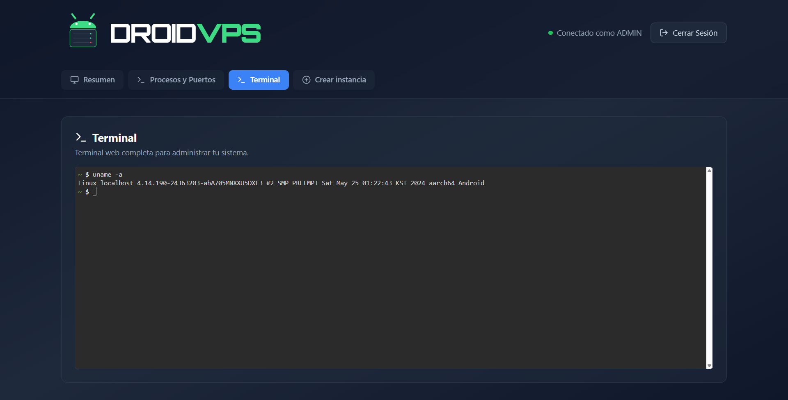
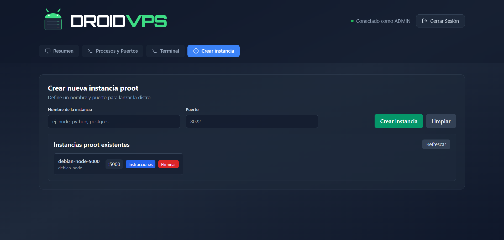

# 📱 DroidVPS

> **Your Android device as a VPS.**

## 🚀 Overview

**DroidVPS** is a mobile VPS platform for Android that transforms your device into a VPS-like environment using Termux and proot-distro (Debian-based). It allows you to run multiple Linux distributions, port-based app deployment, and provides a real-time monitoring dashboard for CPU, RAM, storage, battery, and system metrics.

## ✨ Key Features

- **🐧 Multi-Distribution Support** — Run multiple Debian-based distributions using proot-distro. Each project runs in its own distro to isolate errors and prevent them from affecting others. While you can manually use other distros like Ubuntu, this project is designed and optimized for Debian.
- **🔌 Port Management** — Port handling is managed by Termux (not isolated per distro), making proper port management essential to avoid conflicts between applications
- **📊 Real-Time Monitoring** — Track CPU, RAM, disk, battery, and system performance across all distributions
- **⚡ Lightweight & Fast** — Optimized for mobile hardware
- **🎯 WebSocket Dashboard** — Monitor your VPS in real-time through an intuitive web interface

## 🛠️ Tech Stack

- **Frontend**: Angular + TypeScript + TailwindCSS
- **Backend**: Node.js + Express + WebSocket
- **Environment**: Termux + proot-distro (Debian)
- **Platform**: Android

## 📦 Installation

Check out the [INSTALLATION.md](server-init/INSTALLATION.md) guide for detailed setup instructions.

## 🎯 Quick Start

See [QUICK_START.md](server-init/QUICK_START.md) to get up and running quickly.

## 📖 Features

For a complete list of features, see [FEATURES.md](/FEATURES.md).

## 📸 Screenshots

  <!-- 

    
<b>🖥️ Dashboard Panel (Click to expand)</b>

     
    
    
<em>Real-time monitoring dashboard</em>

  
 -->
  

    
  

  
<em>Real-time monitoring dashboard</em>

  
  
  
<em>Terminal management</em>

  
  
  
<em>Manage multiple distributions</em>

## 📄 License

MIT License — Free to use and modify.

---

  <strong>Built for mobile Linux enthusiasts</strong>

